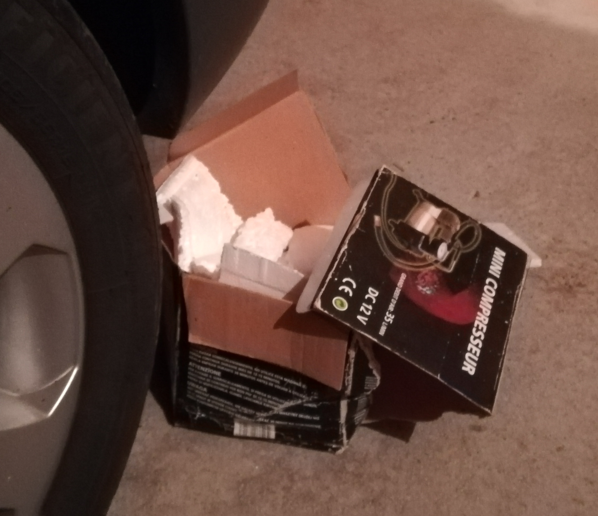
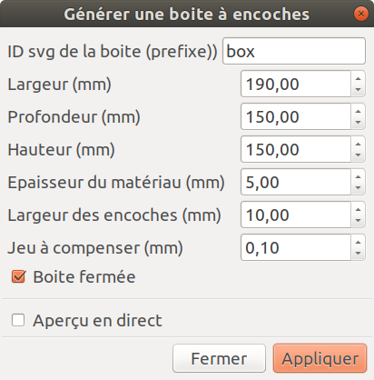
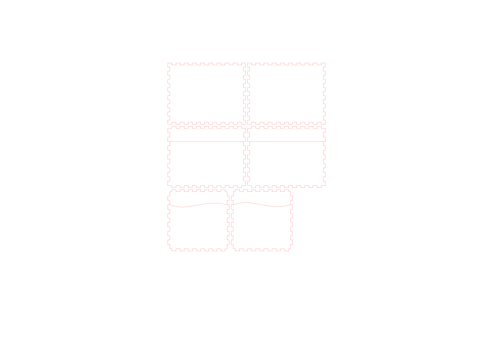
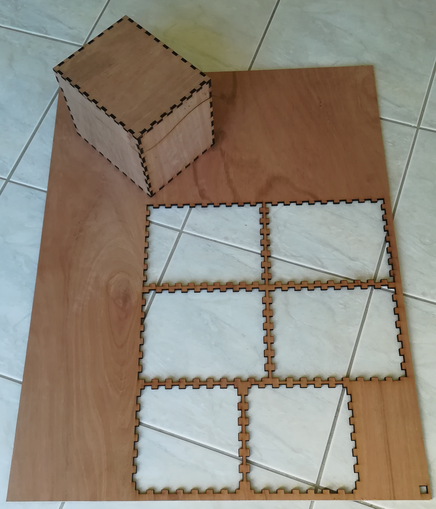
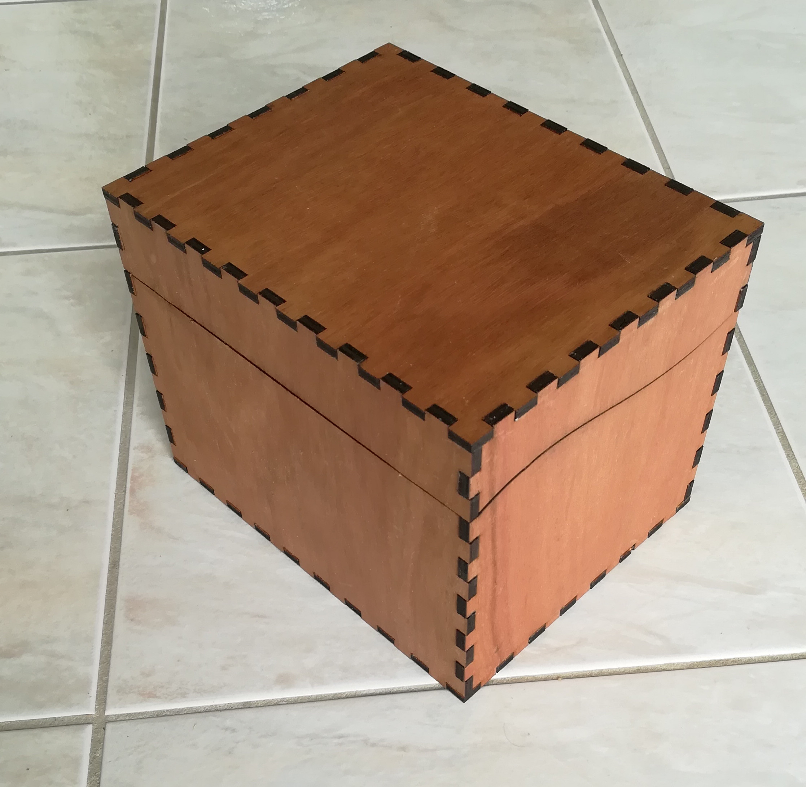
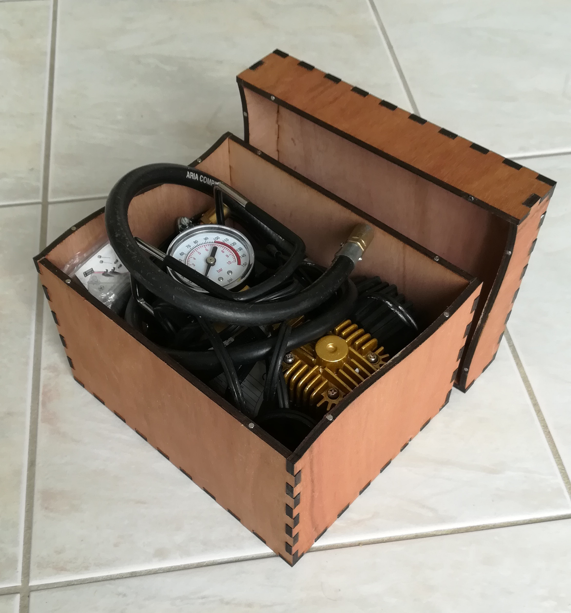

# Boîte mini compresseur 12V

**Licence**: CC-BY-SA 4.0 [](http://creativecommons.org/licenses/by-sa/4.0)
Ce travail est partagé sous licence  [Creative Commons Attribution-ShareAlike 4.0 International License](http://creativecommons.org/licenses/by-sa/4.0)

## Histoire

Un mini compresseur c'est bien pratique. Depuis plusieurs années, après usage, il reprend place dans sa boîte. Mais ce jour là ... un moment d'égarement, et la boîte a mal vieilli... On va lui refaire une boîte et on oubliera cette maladresse.

<center></center>
<center><i>La victime</i></center>

## A propos de la découpe laser

La marche à suivre est décrite dans le wiki du FabLab : [Chaîne logicielle pour découpeuse laser](https://wiki.fablab-lannion.org/index.php?title=Chaine_logicielle_pour_d%C3%A9coupeuse_laser). Pour résumer, il y a trois étapes :
1. [Creation](https://wiki.fablab-lannion.org/index.php?title=Chaine_logicielle_pour_d%C3%A9coupeuse_laser#Cr.C3.A9ation) du modèle à partir d'Inkscape, puis tout convertir en chemin et associer une couleur différente à chaque type de découpe/gravure.
  Ici on a que de la découpe, tout doit être en rouge.  
2. [Export](https://wiki.fablab-lannion.org/index.php?title=Chaine_logicielle_pour_d%C3%A9coupeuse_laser#Export) au format AutoCAD DXF R14
3. [LaserWork](https://wiki.fablab-lannion.org/index.php?title=Chaine_logicielle_pour_d%C3%A9coupeuse_laser#LaserWork), la découpe laser : on ouvre le fichier DXF avec le logiciel RDWorks et on paramètre la découpe.

## Création du modèle

Le modèle a été réalisé avec le logiciel de dessin vectoriel Inkscape (voir la [formation Inkskape sur le Wiki du FabLab](https://wiki.fablab-lannion.org/index.php?title=FormationInkscape)) et l'extension [Tab Generator] qui permet de faire des boîtes.

On fait une boîte fermée à laquelle on ajoute des traits de coupe pour détacher le couvercle.

D'après la [Documentation Tab Generator], il faut saisir les dimensions **extérieures** de la boîte finale.
Aux dimensions intérieures souhaitées, on ajoute donc l'épaisseur du matériau (des deux côtés). On ne compte pas l'épaisseur du trait de coupe (<1mm).
On utilisera une planche de contre plaqué de 5 mm d'épaisseur.

|            | Dimensions intérieurs <br> souhaitées (mm)| Epaisseur matériau <br> (mm) | Dimensions extérieures <br> (mm) |
|-----------:|:-------:|:-----------------------:|:---------------------------:|
| Largeur    | 180     | 5                       | 180 + 2x5 = **190**         |
| Profondeur | 140     | 5                       | 140 + 2x5 = **150**         |
| Hauteur    | 140     | 5                       | 140 + 2x5 = **150**         |

Dans Inkscape:
`Fichier` > `Nouveau à partir d'un modèle...` > `laser template` (pour avoir la zone de découpe de la découpeuse laser).
`Extensions` > `Fablab` > `Générer une boîte à encoches...` et on utilise les paramètres suivants :
- Largeur: 190
- Profondeur: 150
- Hauteur: 150
- Epaisseur du matériau: 5
- Largeur des encoches: 10
- Jeu à compenser: 0,10
  - [x] Boîte fermée



On ajoute ensuite les traits ou courbes de coupe pour détacher le couvercle (outil `Tracer des courbes de Bézier` d'Inkscape). On utilise la couleur rouge pour le contour car c'est la couleur qu'on utilisera pour la découpe.

*Note: Quand on mesure les dimensions de la boîte avec l'outil `Mesurer les distances et les angles` d'Inkscape, les valeurs ne correspondent pas...*

On sauvegarde au format SVG.

<center><i>Fichier boite_mini_compresseur.svg</i></center>

## Export

On convertit tout en chemin (`Chemin` > `Objet en chemin`) et on sauvegarde au format DXF (`Fichier` > `Enregistrer sous` ... puis on choisit le format `AutoCad DXF R14` ).

## Découpe

On ouvre le fichier `boite_mini_compresseur.dxf` avec RDWorks. On paramètre et on lance la découpe.


<center><i>La boîte, tout juste découpée et assemblée "à blanc"</i></center>

## Collage, finition et système de fermeture

- On encolle les encoches à la colle à bois, et on assemble la boîte. Idem avec le couvercle. Attention à ne pas mélanger les morceaux des côtés (la symétrie n'est pas parfaite dans le modèle...) !
- Pour la finition, on applique un vernis en bombe aérosol en trois couches.
- Le système de fermeture sera fait avec des aimants : On perce à divers endroits sur la jonction boîte-couvercle en diamètre 3 mm, coté boîte et côté couvercle. On insert des [petits aimants néodyme de 3mm de diamètre](https://www.amazon.fr/dp/B003BKPIN0/ref=pe_3044141_189395771_TE_dp_1) : un point de colle superglue dans le trou, l'aimant accroché à un petit marteau, on met en position et on appui.
  Pour être sûr de monter les aimants dans le bon sens (qu'ils s'attirent et non se repoussent), une fois tous les trous réalisés, on met en place les aimants d'abord sur la boite. Ensuite on place les aimants du couvercle sur ceux de la boîte. On présente le couvercle en position sur la boîte, et on pousse dessus pour insérer les aimants dans les trous du couvercle. Comme ça les aimants sont forcément dans le bon sens !

 
<center><i>La boîte terminée. A droite, les aimants de 3 mm sont visibles</i></center>

## Évolutions possibles

- Une charnière bois comme celles qu'on peut voir sur [https://festi.info/boxes.py]
- Des décorations gravées sur la boîte
- Des poignées
- ...

## Bibliographie

- Extension Tab Generator pour Inkscape: Le fichier sur le Wiki: [Tab Generator] et la [Documentation Tab Generator]
- [Formations Inkskape sur le Wiki du FabLab]
- [Les découpeuses Keyland KQG1390]
- [Chaîne logicielle pour découpeuse laser]
- Les générateurs de boîtes :
  - http://carrefour-numerique.cite-sciences.fr/fablab/wiki/doku.php?id=projets:generateur_de_boites : le site d'ou vient le plugin Inkscape utilisé ici.
  - https://www.makercase.com : générateur de boîte avec différents types de jointures (plat, encoche, T-slot)
  - [https://festi.info/boxes.py] : de nombreux modèle à générer. Avec ou sans charnières.

## Notes

Pour convertir ce fichier Markdown au format MediaWiki et documenter le projet sur le [Wiki du FabLab] :
```sh
pandoc -w mediawiki README.md -o Projet.wiki
```

<!-- References -->
[Wiki du FabLab]:https://wiki.fablab-lannion.org
[Tab Generator]:https://wiki.fablab-lannion.org/index.php?title=Fichier:Tabs_generator.zip
[Documentation Tab Generator]:http://carrefour-numerique.cite-sciences.fr/fablab/wiki/doku.php?id=projets:plugins_inkscape_fablab:boites_a_encoches
[Formations Inkskape sur le Wiki du FabLab]:https://wiki.fablab-lannion.org/index.php?title=FormationInkscape
[Les découpeuses Keyland KQG1390]:https://wiki.fablab-lannion.org/index.php?title=D%C3%A9coupeuses_Laser_Keyland
[Chaîne logicielle pour découpeuse laser]:https://wiki.fablab-lannion.org/index.php?title=Chaine_logicielle_pour_d%C3%A9coupeuse_laser
[https://festi.info/boxes.py]:https://festi.info/boxes.py
